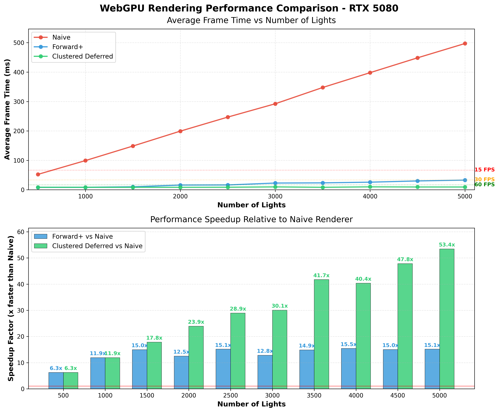

WebGPU Forward+ and Clustered Deferred Shading
======================

**University of Pennsylvania, CIS 565: GPU Programming and Architecture, Project 4**

* Yiding Tian
* Tested on: **Google Chrome 141.0.7390.108** on
  Windows 11, i9-13900H @ 4.1GHz 32GB, RTX 5080 16GB (Personal laptop with external desktop GPU via NVMe connector running in PCIe 4.0x4)

### Live Demo

[](http://webgpu.tonyxtian.com)

[**Click to view live demo deployed at webgpu.tonyxtian.com**](http://webgpu.tonyxtian.com)

### Demo Video

[Demo Video (MP4)](img/webgpu_demo.mp4)

## Project Overview

This project implements Forward+ and Clustered Deferred rendering techniques using WebGPU. The application renders the Sponza Atrium scene with a large number of dynamic point lights, demonstrating the performance benefits of clustered lighting approaches over naive forward rendering.

### Implemented Features

#### Core Features
- **Naive Forward Renderer** (20 points)
  - Basic forward rendering with camera view projection matrix
  - All lights evaluated for every fragment
  - Baseline for performance comparison

- **Forward+ Renderer** (50 points)
  - Screen-space light clustering using compute shader
  - 3D grid of clusters in view frustum
  - Light culling per cluster to reduce per-fragment light evaluations
  - Efficient data structure for tracking light indices per cluster

- **Clustered Deferred Renderer** (15 points)
  - G-buffer with three render targets:
    - Position buffer (rgba16float)
    - Normal buffer (rgba16float)
    - Albedo buffer (rgba8unorm)
  - Reuses clustering logic from Forward+
  - Two-pass rendering: geometry pass and fullscreen lighting pass
  - Decouples geometry complexity from lighting complexity

#### Extra Features

- **Automated Performance Testing System**
  - Comprehensive benchmark runner that automatically tests all rendering modes
  - Systematically varies light count from 500 to 5000 in 500-light increments
  - Collects statistical data (average, minimum, maximum frame times)
  - Real-time progress display showing test status and intermediate results
  - Automatic CSV generation and download for easy data analysis
  - Used to generate all performance data in this README

## Performance Analysis

All benchmarks were conducted on an RTX 5080 16GB GPU using the automated testing system. The display connected has a frame rate of 120Hz thus capping the maximum possible fps to 120. Frame times are measured in milliseconds (lower is better).

### Summary

| Renderer | 500 Lights | 2000 Lights | 5000 Lights | Speedup vs Naive (5000) |
|----------|------------|-------------|-------------|------------------------|
| **Naive** | 52.3ms (19 FPS) | 199.3ms (5 FPS) | 497.2ms (2 FPS) | 1x baseline |
| **Forward+** | 8.3ms (120 FPS) | 16.0ms (63 FPS) | 32.8ms (30 FPS) | **15.1x faster** |
| **Clustered Deferred** | 8.3ms (120 FPS) | 8.3ms (120 FPS) | 9.3ms (107 FPS) | **53.4x faster** |

### Scaling Analysis


*Figure 1: Frame time scaling and speedup comparison. Top chart shows linear degradation for Naive, sublinear for Forward+, and near-constant for Clustered Deferred. Bottom chart quantifies speedup factors relative to Naive.*

**Key Observations:**

**Naive Renderer** - Linear O(fragments × lights) complexity:
- 10x more lights = ~9.5x slower performance
- At 5000 lights: 497ms average (2 FPS), completely unplayable
- Every fragment evaluates every light regardless of influence

**Forward+ Renderer** - Sublinear scaling via clustering:
- 10x more lights = only 4x slower (8.3ms → 32.8ms)
- Maintains 30 FPS even at 5000 lights
- Light clustering dramatically reduces per-fragment light evaluations
- **15x faster than Naive** at high light counts

**Clustered Deferred Renderer** - Near-constant performance:
- Maintains ~8-9ms across all light counts (500-5000)
- **53x faster than Naive** at 5000 lights, **3.5x faster than Forward+**
- Performance independent of light count in tested range
- Decoupled geometry and lighting: G-buffer pass + fullscreen shading pass
- Only shades visible pixels once, eliminating overdraw waste

### Performance Stability


*Figure 2: Frame time variance with min/max ranges (shaded areas). Clustered Deferred shows the most consistent performance.*

Frame time consistency is critical for smooth user experience:
- **Naive**: Extreme variance (8ms min, 1108ms max) causes severe stuttering
- **Forward+**: Moderate variance (8ms min, 50ms max) provides mostly smooth experience
- **Clustered Deferred**: Low variance (8ms min, 17ms max) delivers consistently smooth performance

### Why Clustered Deferred Wins

Despite sharing clustering logic with Forward+, Clustered Deferred is 3.5x faster due to:

1. **Overdraw elimination**: Forward+ wastes work on occluded fragments; Deferred only shades final visible pixels
2. **Decoupled passes**: Geometry complexity doesn't affect lighting cost
3. **Memory efficiency**: Fullscreen pass has optimal cache access patterns
4. **Constant work**: Each pixel shaded exactly once regardless of scene complexity

## Automated Testing System

To enable rigorous performance analysis, I implemented a comprehensive automated benchmarking system that can test all rendering modes across various configurations without manual intervention.

### How It Works

**Single-click UI:**
A "Start Testing" button in the GUI control panel initiates automated benchmarks. The system displays real-time progress and downloads a timestamped CSV file when complete.

**Test Configuration:**
- **Renderers tested**: Naive, Forward+, Clustered Deferred (all three modes)
- **Light counts**: 500, 1000, 1500, 2000, 2500, 3000, 3500, 4000, 4500, 5000
- **Total configurations**: 30 (3 renderers × 10 light counts)

**For each configuration:**
1. Automatically switches to the target renderer
2. 200ms initialization delay
3. 30 frame warmup to stabilize performance
4. 120 frames of timing data collected
5. Statistical analysis (average, minimum, maximum)

### Frame Time Measurement

The system measures **actual frame time** - the time between consecutive frames - rather than just GPU command submission time:

```typescript
// In renderer.ts - measures real frame time
private onFrame(time: number) {
    // ... camera and light updates ...
    this.draw(); // Submit GPU commands
    const frameTime = time - this.prevFrameTime; // Actual frame time
    if (frameTimeCallback) {
        frameTimeCallback(frameTime); // Report to benchmark system
    }
}
```

This approach captures:
- CPU overhead (scene updates, command encoding)
- GPU execution time (actual rendering work)
- Synchronization delays (CPU waiting for GPU)
- True end-to-end performance as experienced by users

**CSV Output Format:**
```csv
Render Mode,Number of Lights,Average Frame Time (ms),Min Frame Time (ms),Max Frame Time (ms)
naive,500,52.345,8.123,1108.456
forward+,500,8.321,8.234,10.123
clustered deferred,500,8.312,8.201,9.876
...
```


### Credits

- [Vite](https://vitejs.dev/)
- [loaders.gl](https://loaders.gl/)
- [dat.GUI](https://github.com/dataarts/dat.gui)
- [stats.js](https://github.com/mrdoob/stats.js)
- [wgpu-matrix](https://github.com/greggman/wgpu-matrix)
